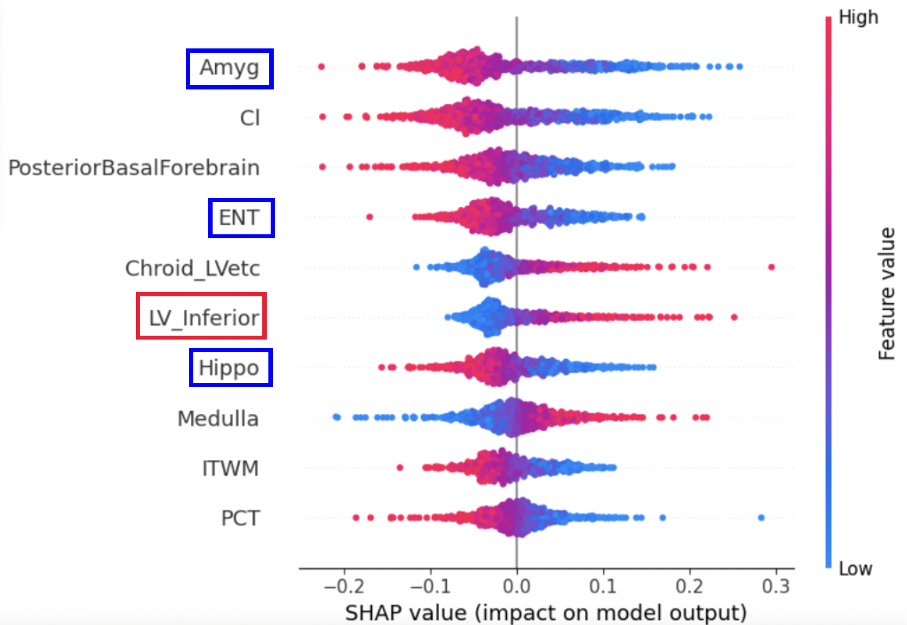

# 研究内容の紹介
## 概要
医療現場において脳MR画像を用いた類似症例検索(CBIR)システムの実現は強く望まれている. これまでに, 脳MR画像から類似症例検索に有効な低次元表現を抽出する機械学習手法が提案され, 一定の成果が得られてきたが, その表現の解釈性には大きな改善の余地が残されている. 本研究では, 脳領域を280の解剖学的領域に分割し, 各領域の体積情報を低次元表現として活用することによるCBIRの実現可能性を検討した. 具体的には, 各脳領域の体積情報からアルツハイマー病に対する診断能を機械学習モデルを用いて評価するとともに, 係数に基づいて注目領域と医学的知見の関連性を確認した. この結果, ADNIデータセットにおいてアルツハイマー病(Alzheimer’s Disease: AD)と健常者(Coginively Normal: CN)のaccuracyスコア 89.5%, macro F1 スコア 88.3%, AUCスコア 0.949 を達成した. これは, 従来の 3D-CNN と 3D-CAE を組み合わせた手法や海馬領域に焦点を当てた手法と同等以上の精度であり、GTと近しい精度でもある. この際, 従来手法では実現困難だった機械学習の解釈性と医学的知見との関連性を一定程度まで持たせることにも成功した。

## 提案手法
この手法は, 脳MR画像をOpenMAP-T1手法を用いてJHUアトラスに基づく280の解剖学的領域に分割し, 各脳領域の左右の平均をとることで脳MR画像を141の解剖学的領域に分割する. このように取得した体積情報を用いてパーセプトロンを学習する. そして, 学習済みのパーセプトロンモデルを用いて AD と CN の症例分類を行う. また, 中間層の出力を特徴量とみなし、各特徴量が予測に対してどれだけ寄与しているかを SHAP を用いて計算することによって解釈性の獲得をすることができる. さらに, 中間層の出力において距離計算を行い, 距離が近い画像を類似画像として取り出すことができる. この手法を用いることで, 解釈性をもたせた類似症例検索を実現できるのではないかと考えた.提案手法を以下に示す.

  

## 結果

| accuracy  | macro f1 |
| ------------- | ------------- |
| 0.895 | 0.883 |

ADとCNに対する寄与度が大きい特徴量上位10個のSHAP値のプロットを以下に示す.

  

図より, 扁桃体(Amyg)の縮小, 嗅内領域(ENT)の縮小, 脳室(LV_Inferior)の拡大, 海馬(Hippo)の縮小というアルツハイマー病患者に見られる特徴を考慮し, ADとCNを識別していることが確認できた.

# 作成したwebサイト
webサイトリンク
https://docker-mila-gyvtzf8oa-mitsuki8854.vercel.app/
